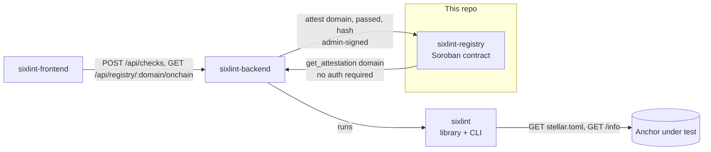
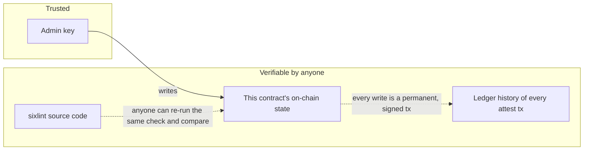
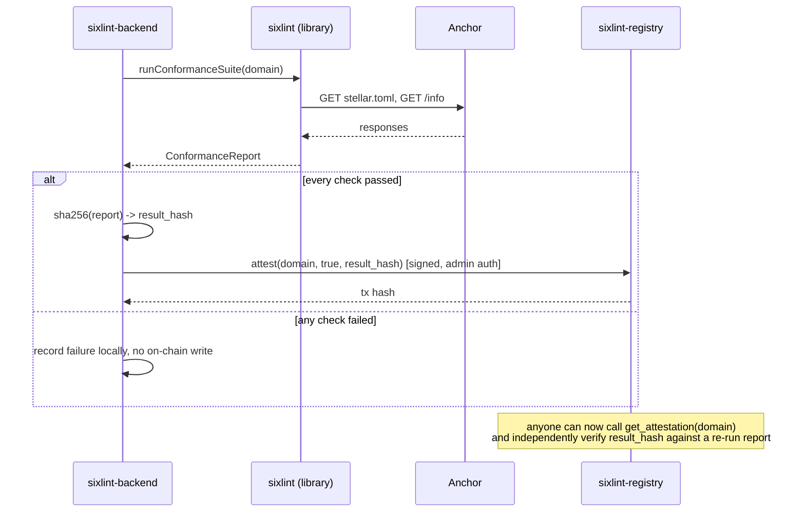

# sixlint-registry

A minimal Soroban smart contract that stores on-chain attestations of
[SEP-6](https://github.com/stellar/stellar-protocol/blob/master/ecosystem/sep-0006.md)
conformance checks — a durable, publicly queryable answer to "is this
anchor's SEP-6 (programmatic deposit/withdraw) implementation currently
verified?" that doesn't depend on trusting whoever runs the checker.

Fourth and final instance in this project lineage, mirroring
[`sep24-attestation-registry`](https://github.com/SEP-24-conform/sep24-attestation-registry),
[`corridorlint-registry`](https://github.com/sep31-conformance/corridorlint-registry),
and
[`rfqlint-registry`](https://github.com/RFQLint/rfqlint-registry)'s
exact pattern:

- [`sixlint`](https://github.com/SixLint/sixlint) — the checking library + CLI. Produces the results this contract stores.
- **This repo** — the on-chain record.
- [`sixlint-backend`](https://github.com/SixLint/sixlint-backend) — the API service that runs the checker and writes to this contract.
- [`sixlint-frontend`](https://github.com/SixLint/sixlint-frontend) — dashboard over that backend.



This repo depends on nothing else in the project — pure Soroban contract
code with no knowledge of the checker or backend beyond the shape of the
data it's handed.

## Table of contents

- [Why this exists](#why-this-exists)
- [This contract vs. its three siblings](#this-contract-vs-its-three-siblings)
- [Trust model](#trust-model)
- [Data model](#data-model)
- [Interface reference](#interface-reference)
- [Sequence: from check to on-chain record](#sequence-from-check-to-on-chain-record)
- [Deployed instances](#deployed-instances)
- [Storage and TTL considerations](#storage-and-ttl-considerations)
- [Security considerations](#security-considerations)
- [Testing philosophy](#testing-philosophy)
- [Development](#development)
- [Deploying your own instance](#deploying-your-own-instance)
- [Design decisions](#design-decisions)
- [What this deliberately does not do](#what-this-deliberately-does-not-do)
- [FAQ](#faq)
- [Contributing](#contributing)
- [License](#license)

## Why this exists

`sixlint` can tell you, right now, whether an anchor's SEP-6
implementation matches spec. But that result only exists wherever the
check happened to run. A wallet, exchange, or directory site deciding
whether to trust an anchor's programmatic deposit/withdraw support needs
a durable, independently queryable answer instead of a one-off terminal
output. This contract is that: an off-chain backend runs the real check,
and only on a pass, submits a signed attestation here.

## This contract vs. its three siblings

The underlying problem — "durably record a pass/fail + hash for a domain,
signed by one admin key" — is identical regardless of which SEP is being
attested to, so this contract's Rust source is structurally the same as
all three siblings' (`sep24-attestation-registry`, `corridorlint-registry`, `rfqlint-registry`).
Deliberate reuse of a proven, already-audited-in-full pattern across all
four, not duplicated effort by accident. What differs each time is only
the surrounding context: a separate deployment, a separate admin key, and
attestations that mean a different specific claim — here, "this domain's
SEP-6 implementation conforms."

## Trust model

This contract does **not** run any checks itself and has no opinion on
what "conformant" means. It's a signed, timestamped bulletin board with
exactly one poster:

- **Trust the admin key** to only submit attestations reflecting real
  conformance runs. The admin is a single Stellar account, currently held
  by `sixlint-backend`.
- Every write is a permanent, signed, publicly-visible Stellar
  transaction — the admin can overwrite what the *current* attestation
  for a domain says, but cannot rewrite the historical record of what it
  submitted and when.
- Because `sixlint` is open source, anyone can independently
  re-run the same check and compare against `result_hash` — the admin's
  claims are falsifiable, not just asserted.
- If the admin key were compromised, an attacker could write false
  attestations until `set_admin` rotates to a new key — no multi-sig or
  governance layer over the admin role in this version, same open
  trade-off as all three sibling contracts.



## Data model

```rust
pub struct Attestation {
    pub timestamp: u64,       // ledger close time (unix seconds) when written
    pub passed: bool,         // whether the conformance run had zero failures
    pub result_hash: BytesN<32>,  // hash of the full report, e.g. SHA-256
}
```

A single map from domain (`String`) to its most recent `Attestation`,
overwritten on each new `attest` call — current status, not a history log.

## Interface reference

| Function | Auth required | Description |
|---|---|---|
| `initialize(admin: Address)` | — | One-time setup. Panics if already initialized. |
| `get_admin() -> Address` | — | Returns the current admin address. |
| `set_admin(new_admin: Address)` | current admin | Rotates the admin key. |
| `attest(domain: String, passed: bool, result_hash: BytesN<32>)` | admin | Records a conformance result for `domain`, overwriting any prior attestation for the same domain. |
| `get_attestation(domain: String) -> Option<Attestation>` | — | Reads the latest attestation for `domain`. `None` if never attested. |

## Sequence: from check to on-chain record



## Deployed instances

| Network | Contract ID |
|---|---|
| Testnet | [`CDJ4OM3MYLDDIAKQX32UMGLS5N7R7UC4EDGMIKBM7HJD5363JTECDUVX`](https://stellar.expert/explorer/testnet/contract/CDJ4OM3MYLDDIAKQX32UMGLS5N7R7UC4EDGMIKBM7HJD5363JTECDUVX) |
| Mainnet | not yet deployed |

Round-trip verified for real on this testnet deployment: `testanchor.stellar.org`
was attested with `passed: true` — an honest reflection of that anchor's
real SEP-6 conformance (all 13 checks pass, see
[`sixlint`'s README](https://github.com/SixLint/sixlint#cli-usage)),
not a placeholder value chosen for the demo. Contrast with
[`rfqlint-registry`'s own verification write](https://github.com/RFQLint/rfqlint-registry#deployed-instances),
which used `passed: false` for the same domain — different SEPs, honestly
different real results for the same anchor.

## Storage and TTL considerations

Soroban ledger entries — including this contract's persistent storage —
are subject to a rent/TTL model: an entry that isn't extended can expire
and be archived, requiring an explicit restore to read again. This
contract uses `env.storage().persistent()` for attestation records, so
entries for domains that stop being re-checked will eventually approach
their TTL. No automatic extension happens here —
[`soroban-ttl-doctor`](https://github.com/soroban-doc-ttl/soroban-ttl-doctor),
a separate project built specifically for this risk, is a direct fit for
monitoring this contract's own instance and persistent entries — and, per
that project's own README, was itself validated in part by dogfooding
against one of this contract's sibling deployments.

## Security considerations

- **Single admin key** — the contract's main centralization point, by
  design, keeping it small enough to audit in full.
- **No re-entrancy or asset-custody surface** — this contract never
  holds, transfers, or has authority over any asset.
- **`domain` is an unvalidated string** — validation happens in
  `sixlint-backend` before `attest` is ever called.
- **Admin rotation has no timelock** — same open trade-off as all three
  sibling contracts.

## Testing philosophy

7 unit tests. The one worth calling out: `attest_fails_without_the_admins_authorization`.
`env.mock_all_auths()` (used in every other test here) bypasses every
`require_auth()` check regardless of caller, which means a test suite
that only ever uses it can reach 100% coverage on `attest()` without
proving the admin gate actually works. This test builds a fresh `Env`
with no blanket auth mock, so `attest`'s `admin.require_auth()` has
nothing backing it and must panic — the only way to prove the
authorization check is load-bearing rather than untested-but-assumed.
Identical reasoning, and near-identical code, to all three sibling
contracts' equivalent tests.

## Development

```sh
cargo test              # 7 unit tests, including the negative auth test above
stellar contract build   # -> target/wasm32v1-none/release/registry.wasm (~2.9KB)
```

## Deploying your own instance

```sh
stellar keys generate sep6-registry-admin --network testnet --fund
stellar contract build
stellar contract deploy \
  --wasm target/wasm32v1-none/release/registry.wasm \
  --source sep6-registry-admin --network testnet --alias registry
stellar contract invoke --id registry --source sep6-registry-admin --network testnet -- \
  initialize --admin "$(stellar keys address sep6-registry-admin)"
```

As with all three sibling projects, the deploying key isn't necessarily
the key that should sign attestations day to day — rotate admin via
`set_admin` to a dedicated key held only by whatever backend operates
this instance.

## Design decisions

**Why Soroban and not a regular database?** A database the backend
controls is exactly the "trust a centralized list" problem this project
exists to avoid — putting the record on Stellar means the write is a
public, signed, timestamped transaction anyone can audit independently.

**Why not store the full report on-chain instead of a hash?** Cost and
boundedness — a hash is enough to verify a specific report matches what
was attested, at fixed, minimal cost.

**Why does this contract's source deliberately match all three sibling
contracts instead of being written fresh?** The underlying problem is
identical regardless of which SEP is being attested to — see
[This contract vs. its three siblings](#this-contract-vs-its-three-siblings).
Writing a "fresh" version each time would only introduce a chance for all
four to silently diverge in behavior for no functional reason.

**Why is it meaningful that this contract's real verification write used
`passed: true` while rfqlint-registry's used `passed: false` for
the same domain?** It's the clearest evidence across this whole lineage
that these attestations reflect genuinely independent, real check
results rather than a templated demo value copy-pasted across four
repos — the same anchor is honestly conformant on one SEP and honestly
broken on another, and the on-chain record for each says exactly that.

## What this deliberately does not do

- Run conformance checks itself (that's `sixlint`'s job).
- Store more than the latest attestation per domain.
- Provide any reputation, scoring, or ranking beyond a single pass/fail
  bit.
- Enforce anything about what a "domain" string looks like.
- Provide governance, multi-sig, or timelock protection over the admin
  role.

## FAQ

**Why not reuse one of the sibling contracts' deployed instances for
SEP-6 attestations too, since the code is identical?** Because the four
record fundamentally different claims — a wallet or anchor querying this
contract needs to know unambiguously which SEP's conformance it's
reading. Separate deployments keep that unambiguous, as illustrated
directly by the differing `passed` values noted above.

**What happens if the admin key is lost?** Nothing already-written is
lost — existing attestations remain readable forever. But no *new*
attestations can be written, since `set_admin` itself requires the
current admin's signature.

**Can anyone call `get_attestation`?** Yes — no authentication required.
See `sixlint-backend`'s `/api/registry/:domain/onchain` endpoint
for a worked example of a trustless read.

## Contributing

Same extension points as all three sibling repos (attestation history,
richer result data, admin governance) — worth linking issues across all
four rather than solving the same design question independently four
times.

## License

Apache-2.0
